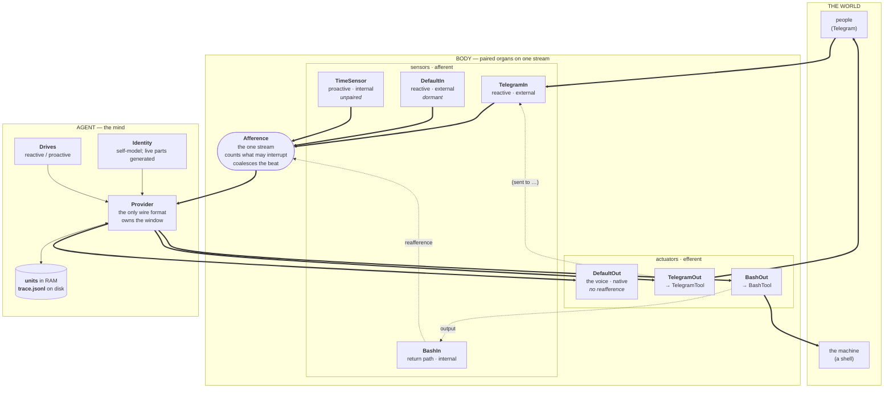
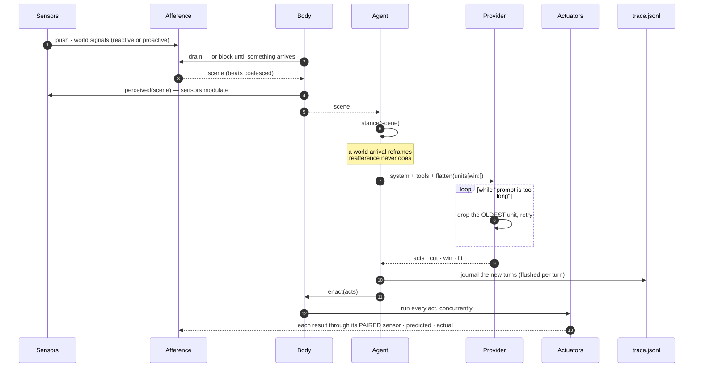

# Architecture

[`spec.md`](spec.md) states the model. This document states the machine: what the components are, and how a signal moves through them.

One file, two halves. **The framework never names an organ. This agent never contains mechanism.** If a `if actuator.name == "TelegramOut"` appears in the framework half, something has gone wrong.

---

## Logical architecture



Thick arrows are signals in flight. **Dotted arrows are reafference** — an act's result coming home through the sensor paired to that actuator. That is why a `BashOut` result arrives tagged `BashIn[int]` (internal — proprioception, feeling your own hand) while a `TelegramOut` result arrives tagged `TelegramIn[ext]` (external — hearing your own words land). One mechanism, two sides, and the difference is what makes the *-ceptions* emergent instead of built.

`DefaultOut` has no dotted arrow, and it is worth being precise about why: it *does* name `DefaultIn` as its pair, but it is **native** rather than willed, so its acts carry no `ref`, and `Body._run` returns nothing before the pair is ever consulted. Plain text reaches no one, so a fully-predicted act is cancelled as perception. The absent return path is not a missing wire; it is the wire declining to fire.

Notice what the diagram does **not** contain: no scheduler, no retrieval engine, no memory subsystem, no interrupt channel. Each of those is either a consequence of the wiring or a file the agent tends with its own hands.

---

## Components

### The currency

| | |
|---|---|
| `Signal` | The only thing that moves. `content · side · origin · source · target · drive · ref · predicted · took · at`. `origin` (world/self) decides whether it can reframe a turn or interrupt one; `ref` binds a result to the act that caused it; `predicted` is the efference copy. |

### The stream

| | |
|---|---|
| `Afference` | The single input queue, and the only component that knows two things: **what is waiting that could interrupt** (a count of pending reactive arrivals) and that **interoception is level-triggered** — repeated beats from one source coalesce to the most recent, because a body perceives how long it has been, once, not a log of every moment that passed. |

### The ports

| | |
|---|---|
| `Sensor` | An afferent port, declaring one of three things: `REACTIVE` (faces the world, someone waits — may interrupt), `PROACTIVE` (faces the world, nothing waits — fires in the gaps), or **unset** (a pure return path that only ever stamps results; `signal()` on it asserts). A sensor may be two of these — `TelegramIn` is reactive *and* `TelegramOut`'s return path. Hooks: `status()` for liveness, `perceived(scene)` to modulate on what arrived, `resume(at)` to be told at wake when the life was last active. |
| `Actuator` | An efferent port. Native, or fronting a `Tool`. Carries `pair` — the sensor its result returns through. Exposed to the mind iff a tool sits behind it. |
| `Tool` | A capability: `description · schema · run()`. Stateless over immutable config, so one actuator can carry many concurrent acts. |
| `ToolRegistry` | Dispatch by name, and the specs handed to the model. |

### The mind

| | |
|---|---|
| `Drive` | A stance: when it fires, and the band of prompt it contributes. Two ship: reactive and proactive. |
| `Provider` | The reasoning engine, the **only** component that speaks a wire format, and the owner of the sliding window. Everything shaped by the API lives here: rendering a scene into turns, recording the assistant turn, streaming, the overflow loop, and how thinking is handled. |
| `Identity` | The self-model. Authored prose states the model; **anything naming a live part is generated** — organ lists, pairings, liveness, the reaching organ, paths, dates, the state of the window. |

### The assemblies

| | |
|---|---|
| `Body` | The organs on the stream. `perceive` · `enact` · `abort` · `describe`. |
| `Agent` | Provider + identity + drives + the unit buffer + the life-file, and the loop that couples them to a body. |

---

## Dataflow: one cycle



Because a result re-enters the same stream a sensor feeds, **an act chains straight into the next cycle** — the queue is non-empty, so there is no wait. Only silence reaches the beat. That is the whole rhythm: the agent free-runs while it is doing something, and time appears when it stops.

### Perceive

```
drain the stream                     → everything waiting, in one scene
  empty? block until something arrives (a long watchdog is the only backstop)
coalesce                             → one beat per proactive source
notify sensors                       → e.g. the clock resets its backoff on a person's arrival
```

The beat backs off **5s → 30min** as quiet holds. That costs nothing, because the loop blocks on the queue rather than on a sleep — a message pierces a thirty-minute wait instantly.

### Stance

Stance is not hardcoded — it is the ordered drive list, and the first match wins:

```python
def stance(self, scene):                 # §8, the whole of it
    for d in self.drives:
        if d.active(scene): self.framing = d; break
    return self.framing.text
```

If no drive fires, `self.framing` is left as it was — that is what makes a stance persist through a mid-episode turn. The two drives shipped in `build()` supply the actual conditions:

```python
Drive(REACTIVE,  lambda sc: any(s.drive == REACTIVE  for s in opens(sc)), …)   # someone waits — first, so it wins ties
Drive(PROACTIVE, lambda sc: any(s.drive == PROACTIVE for s in opens(sc))
                            and not reafference(sc), …)                        # the gap, and only the gap
```

Both filter through `opens()` (`origin == "world"`), which is what keeps reafference from reframing anything. Adding a stance means adding a `Drive` to that list — see [`CONTRIBUTING.md`](CONTRIBUTING.md).

Reafference **shields** a live exchange, so the beat cannot hijack a turn already underway.

**The bypass is a property of the signal, not of the sensor.** `Sensor.reafferent()` stamps `origin="self"` and leaves `drive` unset on the signal it makes, so a result flows home through *any* pair sensor without touching the stance — including through a `REACTIVE` one like `TelegramIn`. The same field gates interruption in `Afference.put`, which counts only `origin == "world" and drive == REACTIVE`. So one field, read in two places, is the entire reason your own hand can neither reframe your turn nor seize it.

Leaving `drive` unset on a *pure* return path buys one more guarantee: `Sensor.signal()` asserts `drive is not None`, so a return path cannot manufacture a world arrival even by mistake.

### Think — the window

Context is `system + tools + flatten(units[win:])`. A **unit** is the run of messages between consecutive `tool_result`-free user turns:

```
[ user opens ][ assistant: tool_use ][ user: tool_result ][ assistant: tool_use ][ user: tool_result ][ assistant: no calls ]
└──────────────────────────────────────── ONE UNIT ─────────────────────────────────────────────────────────────────────┘
▲ the only cut that needs no rewriting
```

That is the smallest slice the Messages contract permits untouched. Cut anywhere else and you either open the array on an assistant turn or orphan a `tool_result` — both rejected. Slicing on units means **the view is always a verbatim suffix of the record**: nothing rebuilt, nothing invented.

Everything held is sent. On `prompt is too long`, the oldest unit is dropped and the call retried, until the provider accepts:

```
win=0  units[0..63]  296 msgs  → 400 → drop unit 0 (16 msgs)
win=1  units[1..63]  280 msgs  → 400 → drop unit 1 (14 msgs)
win=2  units[2..63]  266 msgs  → 200
```

No tokenizer, no per-model context constant — the API is the oracle, so changing models needs no configuration. The search is **linear, never binary**: a rejection is free, a success is billed, so a binary search would pay for inference it then discards.

The current unit is never evictable. The count that fit is remembered across wakes, so waking does not linear-search from the top.

### Journal — or discard an empty beat

The new turns are appended to `trace.jsonl` under their unit id, flushed per turn, before any act runs. A continuing episode keeps the *same* id, which is what makes `grep '"unit": N'` return one complete exchange with nothing straddled.

One scene is not journalled. When the model produced **no acts** on a **pure beat** — no reafference, no reactive arrival — and the unit it opened contains nothing but this turn, that unit is popped:

```python
beat = not reafference(scene) and all(s.drive == PROACTIVE for s in opens(scene))
if not acts and beat and opened and added == len(self.units[-1]):
    self.units.pop()                       # a beat that produced nothing is not an episode
```

All four conditions are load-bearing: the last two are what make it impossible for the pop to reach anything older than the turn just added, and `beat` is what makes it impossible to discard a moment that perceived a person. Without this, a twelve-hour quiet night at `TICK_MAX` deposits two dozen empty units into both the record and the window. The accepted cost: a beat where the model only *thought* and decided to do nothing loses that thinking.

### Enact

Every act runs concurrently. The model chooses sequencing by the *shape* of what it emits — several calls in one turn run together; one call, its result, then another is sequential. The executor never asks why, and never serializes.

Results **re-enter together**, though, because the wire format requires every `tool_use` to be answered in the very next message. Parallel execution, synchronized return.

---

## Persistence

```
~/.precognitive/                     the self — it outlives every process
├── trace.jsonl        one life, append-only, one line per message, tagged with its unit
└── memory/memory.md   what the agent chose to distil, in its own words
```

| | Written by | Read by | Bounded |
|---|---|---|---|
| `trace.jsonl` | the harness, flushed per turn | the agent, with bash | no — it only grows |
| `memory.md` | **the agent**, with bash | the agent, with bash | no |
| units buffer | the harness | the provider | **yes** — RAM is constant at any lifespan |
| the window | computed | the provider | whatever the API accepts |

The asymmetry is deliberate: **the agent reads either layer and writes only `memory.md`.** Recall is an ordinary act through its hands — `grep`, `tail`, a pipe — not a retrieval system it is subject to.

Everything that has to be bounded is bounded by one constant, and each of them answers a different question:

| | | Bounds |
|---|---|---|
| `BUFFER` | 150 units | RAM at any lifespan. `_trim` drops from the front, but `drop = min(len - BUFFER, win)` — never into the live view, so the view wins over the bound |
| `FIT_MARGIN` | 2 units | how far above the remembered fit a wake loads, so it probes rather than assumes |
| `OUT_CAP` | 8000 **characters** | one act's result, so a single command can never blow the window and strand the current unit. Note the comparison is `len()` on the decoded string, so UTF-8-heavy output can still exceed 8000 *bytes*; the truncation note the agent sees says "bytes" and means characters |
| `TICK_MIN` / `TICK_MAX` | 5s → 1800s | the beat's backoff. Free, because the loop blocks on the queue rather than on a sleep |
| `WATCHDOG` | 3600s | the backstop on `perceive`, so a body whose every sensor died does not block forever |

Both layers are stamped UTC, which is what makes the join work:

```bash
grep -i "houston" memory.md            # the gist — and its timestamp
grep '"at": "2026-08-14' trace.jsonl   # that day
grep '"unit": 41207'     trace.jsonl   # that entire exchange, verbatim
```

A distilled memory recovers the *when*; the when names the *unit*; the unit is the whole moment with nothing straddled.

### Wake

```
read the tail of trace.jsonl backwards → O(tail), never O(life)
regroup by unit id
discard a leading partial unit         → the buffer begins on a boundary, so no rewriting
heal                                   → synthesize results for any tool_use left dangling
position the window from the remembered fit
tell the organs when the life was last active
```

Healing synthesizes **only** the missing `tool_result`s. A dangling *user* turn needs no repair — consecutive user turns are combined by the API — and inventing an assistant turn to balance it would be the harness putting words in the model's mouth.

### Interruption

A pending reactive arrival is the interrupt. Both the stream loop and any long-running tool consult the same predicate, and neither knows what a keyboard is.

```
a person's message lands           → the stream's pending count rises
  the streamed turn is cut         → the partial thought is kept
  a running command is killed      → its partial output is kept
  acts that never began            → synthetic results, so every tool_use stays answered
next scene: what you began · what died · what never ran · and the message that explains it
```

The interrupting signal *is* the explanation, so nothing needs announcing. Any note the harness owes goes into the next **user** turn, after the results — never into the assistant turn.

---

## Invariants

Break these and the agent goes subtly wrong rather than loudly broken.

1. **`tool_use` is the last block of its assistant turn.** Anything after it makes the API treat it as unanswered, even with the `tool_result` present in the next message. Enforced by construction, not discipline.
2. **Harness text never enters an assistant turn.** That turn records what the *model* produced. If the model produced nothing, append no turn.
3. **Every `tool_use` is answered** — by a real result, an interrupt synthetic, or a wake heal. This is what keeps the unit boundary reliable.
4. **The record only grows.** Sliding moves an index; the file is never rewritten, and the view is a verbatim suffix.
5. **Never drop a turn that perceived exafference** — any signal with `origin == "world"` *except* a bare beat. The record is the only copy; the signal was already taken off the queue. The one discard is the empty beat above, and it is narrow by construction: no acts, no reafference, every world arrival `PROACTIVE`, and the unit containing nothing but the turn just added. Note that a beat *is* `origin == "world"` (it is `side == "internal"` — interoception, not the world reaching in), so this invariant is stated on the beat, not on `origin` alone.
6. **Only reactive world signals interrupt.** Not your clock, not your own hand.
7. **Anything naming a live part is generated, never authored.**
8. **Never tell the agent something it cannot verify.** An earlier version showed it its own source; it read a config variable, failed to find it in the one shell it could reach, and concluded it could message no one — which was false.
