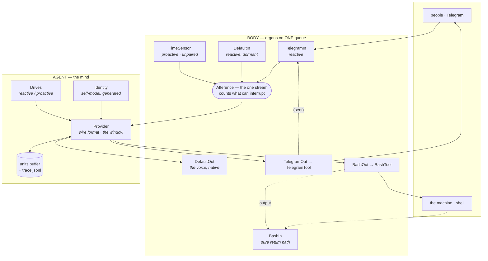

# Contributing to precog

Read [`spec.md`](spec.md) first. It is the canonical model; the code is an implementation of it, and a change that contradicts the spec is a change to the spec — say so explicitly in your PR.

**The organizing rule:** the file is in two halves. *The framework* never names an organ. *This agent* never contains mechanism. If you find yourself writing `if actuator.name == "TelegramOut"` in the framework half, the design is telling you something.

---

## Architecture



Solid arrows are signals in flight. **Dotted arrows are reafference** — an act's result coming home through the sensor paired to that actuator. That return is the whole point of the pairing: it is why `BashOut` results arrive tagged `BashIn[int]` (internal — proprioception) while `TelegramOut` results arrive tagged `TelegramIn[ext]` (external — hearing your own words land).

### Components

| | Role |
|---|---|
| `Signal` | the only currency. `content · side · origin · drive · ref · predicted · took · at` |
| `Afference` | the one input stream; also the only thing that knows what is waiting that can interrupt |
| `Sensor` | an afferent port. Faces the world (declares a `drive`, pushes), or is purely a return path (`drive = None`), or both |
| `Actuator` | an efferent port. Native, or fronting a `Tool`. Carries `pair` — the sensor its result returns through |
| `Tool` | a capability behind an exposed actuator: `description · schema · run()` |
| `ToolRegistry` | dispatch by name, and the exposed specs handed to the model |
| `Drive` | a stance: when it fires, and the prompt band it contributes |
| `Provider` | the reasoning engine, the **only** thing that speaks a wire format, and the owner of the sliding window |
| `Identity` | the self-model. Prose states the model; anything naming a live part is generated |
| `Body` | the organs, `perceive`, `enact`, `abort`, `describe` |
| `Agent` | provider + identity + drives + the unit buffer + the life-file + the loop |

---

## Dataflow: one cycle

```mermaid
sequenceDiagram
    participant S as Sensors
    participant Q as Afference
    participant B as Body
    participant A as Agent
    participant P as Provider
    participant X as Actuators

    S->>Q: push (world · reactive/proactive)
    B->>Q: drain — or block until something arrives
    Q-->>B: scene (coalesced)
    B->>A: scene
    A->>A: stance(scene) — a world arrival reframes; reafference never does
    A->>P: system + tools + flatten(units[win:])
    loop while "prompt is too long"
        P->>P: drop the OLDEST unit, retry
    end
    P-->>A: acts · cut · win · fit
    A->>B: enact(acts)
    B->>X: run all acts, concurrently
    X-->>Q: each result through its PAIRED sensor (predicted · actual)
```

### The stance rule

```python
opens = [s for s in scene if s.origin == "world"]     # only world arrivals reframe
if   any(s.drive == REACTIVE  for s in opens):  framing = REACTIVE     # someone is waiting — wins ties
elif any(s.drive == PROACTIVE for s in opens) and not reafference(scene):
                                                framing = PROACTIVE
# otherwise: unchanged — you are mid-thought
```

Reafference **shields** a live exchange: the beat cannot hijack a turn you are in the middle of. And `origin` does the gatekeeping, which is why a return path's `drive` tag is unreachable rather than merely unset.

### The window

Context is `system + tools + flatten(units[win:])`. A **unit** is the run of messages between consecutive `tool_result`-free user turns:

```
[ user opens ][ assistant: tool_use ][ user: tool_result ][ assistant: final, no tool_use ]
└──────────────────────────── ONE UNIT ─────────────────────────────────────────────────┘
                                                                              ▲ slice here
```

Cutting on a unit boundary is the only cut that needs no rewriting: the remainder opens on a `user` turn and orphans no `tool_result`. `win` advances by one unit per `prompt is too long`, and the view is always a **verbatim suffix of the trace** — nothing rebuilt, nothing invented.

---

## Recipes

### Add a sensor

```python
class WebhookIn(Sensor):
    drive = REACTIVE                        # or PROACTIVE, or omit for a pure return path
    def __init__(self):
        super().__init__("WebhookIn", EXTERNAL, "HTTP webhooks from your services")
    def status(self):                       # live state → generated into the body-schema
        return "LISTENING on :8080" if self.port else "not configured"
    def start(self, stream):                # push sensors spawn a feed
        threading.Thread(target=self._serve, args=(stream,), daemon=True).start()
    def _serve(self, stream):
        ...  stream.put(self.signal(payload, source="webhook"))
```

Then one line in `build()`. Its drive affinity, prompt entry, liveness, and interrupt behaviour all follow — **no prompt edits**, because the self-model is generated from the live body.

Optional hooks: `perceived(scene)` to modulate on what arrived (this is how `TimeSensor` resets its backoff), and `resume(at)` to be told when the life was last active at wake.

### Add an actuator and its tool

```python
class EmailTool(Tool):
    description = "Send an email. Result returns as predicted vs actual."
    schema = {"type": "object", "properties": {
        "to": {"type": "string"}, "subject": {"type": "string"}, "body": {"type": "string"},
        "expect": {"type": "string", "description": "what you predict the reply/effect will be"}},
        "required": ["to", "body"]}
    def status(self): return f"READY — {self.addr}" if self.addr else "not configured"
    def run(self, inp, should_stop=None):
        ...
        return f"(sent to {inp['to']})"

class EmailIn(Sensor):  ...                 # the return path
class EmailOut(Actuator):
    def __init__(self, pair): super().__init__("EmailOut", EXTERNAL, pair, tool=EmailTool())
```

Always include `expect` in the schema — the prediction is what makes the result judgeable rather than merely received.

**A `Tool` is a stateless capability over immutable config.** Everything per-call lives in `inp` and locals: the executor may invoke the same tool many times concurrently and will never serialize you. If you need serialization, hold your own lock — `BashTool` does exactly that around container bring-up.

Cap what a tool can return (see `OUT_CAP`). One unbounded result can blow the whole window and leave the current unit unable to fit.

### Add a provider

Implement `respond(system, units, win, scene, specs, should_stop, notes) -> (acts, cut, win, fit)`. The provider owns **everything** wire-shaped: rendering the scene into turns, recording the assistant turn, streaming, the overflow loop, and how thinking is handled.

That last one is provider-specific and worth measuring rather than assuming. This provider flattens thinking into `(reasoning) …` text because DeepSeek **accepts** thinking blocks passed back but does not feed them to the model — probed with a token present only in a returned thinking block: unrecallable natively, recalled when flattened. On the real Anthropic API, signed thinking passed back *is* fed back, so a native provider should pass it through.

### Add a drive

```python
Drive("repair", lambda sc: any(mismatched(s) for s in reafference(sc)),
      "A prediction of yours was wrong. Work out why before doing anything else.")
```

Drives are ordered; first match wins, and if none fires the stance is unchanged (you are mid-exchange). Keep the framing short — it is the last band of the prompt and it competes with everything above it.

---

## Invariants

Break these and the agent gets subtly wrong rather than loudly broken.

1. **`tool_use` is the last block of its assistant turn.** Anything after it makes the API treat it as unanswered even when its `tool_result` is right there in the next message. This is enforced by construction in `_record`, not by discipline.
2. **Harness text never enters an assistant turn.** That turn records what the *model* produced. Everything the harness has to say — `[source · time]` tags, `predicted · actual`, synthetic results, cut notes — goes in the user turn. If the model produced nothing, **append no turn**; consecutive user turns are combined by the API.
3. **Every `tool_use` is answered** — by a real result, an interrupt synthetic, or a wake heal. This is what keeps `opens_unit` a reliable boundary.
4. **The trace only grows.** Sliding moves an index; the file is never rewritten. The view must be a verbatim suffix.
5. **Never drop a turn that perceived the world.** The trace is the only copy — the signal was already taken off the queue. Only a beat that produced neither voice nor act may be discarded.
6. **Only reactive world signals interrupt.** Your own hand returning cannot disturb the thought it serves; your own clock can never break in.
7. **Anything naming a live part is generated, never authored.** Organ lists, pairings, liveness, the reaching organ, paths, dates. A hand-written organ list in the prompt is a lie waiting to happen.
8. **Never tell the agent something it cannot verify.** An earlier version showed it its own source; it read a config variable, failed to find it in the one shell it could reach, and concluded it could message no one — which was false. Self-knowledge comes from the body-schema, which it can check by acting.

---

## Testing

There is a validator that drives the real loop with a mock provider at the wire boundary — no API key, no Telegram, no Docker:

```bash
.venv/bin/python val_experimental.py            # structural suite
VAL_LIVE=1 .venv/bin/python val_experimental.py # + one real API call
```

New behaviour needs a check. Prefer asserting the **invariant** over the implementation: `wf()` verifies a message array against the real contract, so run any history you construct through it.

When a provider's behaviour is in question, **probe it** rather than reasoning from the docs. Two of the rules above came from probes that contradicted a plausible assumption, and the docs are silent on both.

## Style

Single file, dense, comments that say *why* rather than *what* — particularly where a line encodes something learned the hard way. Match the surrounding density. Keep the framework half organ-free.

## Reporting

Include the trace. `~/.precognitive/trace.jsonl` is a complete record, and a unit id (`grep '"unit": N'`) pulls one entire exchange. Redact `TELEGRAM_PEOPLE` ids and anything a `BashOut` result may have picked up — the agent has been known to geolocate its own host.
